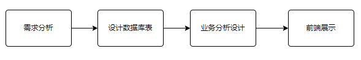
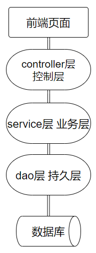
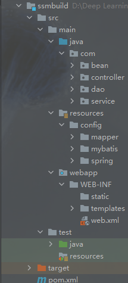
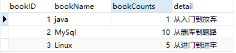
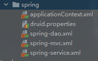

# 基于maven的SSM框架项目整合

## 1.项目通常的设计流程

基本项目流程



SSM框架是由MyBatis框架+Spring框架+SpringMVC框架组成，其内核还是基于MVC的软件架构，实行分层管理，即持久层，业务层，控制层，MyBatis框架实现与持久层，数据库的数据交换，SpringMVC实现与前端界面，控制层的数据交换，Spring作为整个容器来管理整个项目中的所有bean。



本篇只是提供一个模板，例如数据库表的创建，dao层增删改查的方法，前端的数据展示页面都是举例，本篇作为模板意味着只需要复制本项目就可以作为基础模板进行创建，额外的需求可以在该模板上进行添加和修改。

## 2.探讨spring的两种配置问题

spring框架的配置有两种一种是注解式，一种是XML配置文件式，两种都是spring管理bean的方式。本篇主要是基于xml配置文件的形式对bean进行管理。

#### 注解式

注解式是目前市面上较为流行的一种方式，其优点在于方便快捷，可以在编译时就对错误进行检查，修改简单维护方便，缺点是在修改代码时需要重新打包部署编译。

#### XML配置文件式

xml配置文件式优点是便于对项目结构进行分层管理，在修改代码时只需要修改xml配置文件即可不需要重新打包部署编译，缺点是在项目庞大复杂时配置文件会过多难以进行有效的管理。

## 3.maven项目的创建

建议以空项目或quick-start为原型，手动创建webapp，WEB-INF，web.xml等文件以及配置

#### maven项目的pom.xml文件

```xml
<?xml version="1.0" encoding="UTF-8"?>
<project xmlns="http://maven.apache.org/POM/4.0.0"
         xmlns:xsi="http://www.w3.org/2001/XMLSchema-instance"
         xsi:schemaLocation="http://maven.apache.org/POM/4.0.0 http://maven.apache.org/xsd/maven-4.0.0.xsd">
    <modelVersion>4.0.0</modelVersion>

    <!--项目坐标及打包方式-->
    <groupId>com.study.ssm</groupId>
    <artifactId>ssmbuild</artifactId>
    <version>1.0-SNAPSHOT</version>
    <packaging>war</packaging>

    <properties>
        <project.build.sourceEncoding>UTF-8</project.build.sourceEncoding>
        <maven.compiler.source>1.8</maven.compiler.source>
        <maven.compiler.target>1.8</maven.compiler.target>
    </properties>
    <!--防止报错插件-->
    <build>
        <plugins>
            <plugin>
                <groupId>org.apache.maven.plugins</groupId>
                <artifactId>maven-war-plugin</artifactId>
                <version>3.3.1</version>
            </plugin>
        </plugins>
        <!-- 资源拷贝插件 静态资源导出-->
        <resources>
            <resource>
                <directory>src/main/java</directory>
                <includes>
                    <include>**/*.xml</include>
                    <include>**/*.properties</include>
                </includes>
                <filtering>false</filtering>
            </resource>
            <resource>
                <directory>src/main/resources</directory>
                <includes>
                    <include>**/*.xml</include>
                    <include>**/*.properties</include>
                </includes>
                <filtering>false</filtering>
            </resource>
        </resources>
    </build>
    <dependencies>
        <!--依赖-->
        <!-- JUnit -->
        <dependency>
            <groupId>junit</groupId>
            <artifactId>junit</artifactId>
            <version>4.13.2</version>
            <scope>test</scope>
        </dependency>
        <!-- druid数据库连接池 -->
        <dependency>
            <groupId>com.alibaba</groupId>
            <artifactId>druid</artifactId>
            <version>1.2.5</version>
        </dependency>
        <!-- 数据库连接包 -->
        <dependency>
            <groupId>mysql</groupId>
            <artifactId>mysql-connector-java</artifactId>
            <version>8.0.26</version>
        </dependency>
        <!-- Servlet -->
        <dependency>
            <groupId>javax.servlet</groupId>
            <artifactId>javax.servlet-api</artifactId>
            <version>4.0.1</version>
            <scope>provided</scope>
        </dependency>
        <!-- Jsp -->
        <dependency>
            <groupId>javax.servlet.jsp</groupId>
            <artifactId>javax.servlet.jsp-api</artifactId>
            <version>2.3.3</version>
            <scope>provided</scope>
        </dependency>
        <!-- Jstl -->
        <dependency>
            <groupId>javax.servlet</groupId>
            <artifactId>jstl</artifactId>
            <version>1.2</version>
        </dependency>
        <!--MyBatis-->
        <!-- mybatis -->
        <dependency>
            <groupId>org.mybatis</groupId>
            <artifactId>mybatis</artifactId>
            <version>3.5.7</version>
        </dependency>
        <!-- mybatis与spring整合包 -->
        <dependency>
            <groupId>org.mybatis</groupId>
            <artifactId>mybatis-spring</artifactId>
            <version>2.0.6</version>
        </dependency>
        <!--Spring-->
        <!-- spring -->
        <dependency>
            <groupId>org.springframework</groupId>
            <artifactId>spring-context</artifactId>
            <version>5.3.9</version>
        </dependency>
        <!-- spring-mvc -->
        <dependency>
            <groupId>org.springframework</groupId>
            <artifactId>spring-webmvc</artifactId>
            <version>5.3.9</version>
        </dependency>
        <!-- spring-jdbc -->
        <dependency>
            <groupId>org.springframework</groupId>
            <artifactId>spring-jdbc</artifactId>
            <version>5.3.9</version>
        </dependency>
        <!-- spring-aop -->
        <dependency>
            <groupId>org.springframework</groupId>
            <artifactId>spring-aop</artifactId>
            <version>5.3.9</version>
        </dependency>
        <!-- Spring5和Thymeleaf整合包 视图控制器-->
        <dependency>
            <groupId>org.thymeleaf</groupId>
            <artifactId>thymeleaf-spring5</artifactId>
            <version>3.0.12.RELEASE</version>
        </dependency>
        <!--日志-->
        <dependency>
            <groupId>ch.qos.logback</groupId>
            <artifactId>logback-classic</artifactId>
            <version>1.2.3</version>
        </dependency>
        <!-- Lombok -->
        <dependency>
            <groupId>org.projectlombok</groupId>
            <artifactId>lombok</artifactId>
            <version>1.18.20</version>
            <scope>provided</scope>
        </dependency>
    </dependencies>
</project>
```

这些依赖项是基本基于maven的ssm项目所共有的，其中需要额外说明的，druid连接池依赖需要与数据库连接依赖一同导入，此外本项目使用的日志文件是logback，本项目使用了lombok，对项目的侵入性较大但是同时可以节省许多开发步骤

## 4.maven项目结构

使用maven项目结构可以很好地管理依赖项，同时可以很好的管理分层结构与对应的配置文件

### maven项目目录



其中java目录下写主要的分层目录，在分层目录中写对应的类及方法，在resources目录下写对应的配置文件，由于ssm框架具有复杂众多的配置文件，所以在该目录下主要分为三层，/config为所有配置文件的主目录，/mapper放置dao层接口对应的SQL映射文件，/mybatis放置MyBatis的mybatis-config.xml配置文件，主要用于对MyBatis框架进行相关设置以及注册SQL映射文件，/spring下放置为spring的配置文件。

## 5.数据库的设计

本篇数据的设计比较基础，并没有涉及多表联查等，分页查询等复杂操作，数据库也只有一张表



其中bookID作为主键，所有属性均不能为空，由于该表比较简并没有考虑主键断裂等问题，会在以后的学习中进行推进

## 6.MyBatis框架

使用MyBatis框架首先应该在maven的pom.xml配置文件中引入相关依赖，MyBatis是实现持久层与数据库的数据交换。每个框架最主要的就是配置文件的编写，在maven的项目目录中/mapper放置dao层接口对应的SQL映射文件，/mybatis放置MyBatis的mybatis-config.xml配置文件，主要用于对MyBatis框架进行相关设置以及注册SQL映射文件。

#### mybatis-config.xml配置文件

```xml
<?xml version="1.0" encoding="UTF-8" ?>
<!DOCTYPE configuration
        PUBLIC "-//mybatis.org//DTD Config 3.0//EN"
        "http://mybatis.org/dtd/mybatis-3-config.dtd">
<configuration>
    <!--配置数据源交给spring-->
    <!--别名-->
    <!--    <typeAliases>-->
    <!--        <package name="com"/>-->
    <!--    </typeAliases>-->
    <!--相关设置-->
    <!--    <settings>-->
    <!--        <setting name="" value=""/>-->
    <!--    </settings>-->
    <!--注册sql映射文件-->
    <mappers>
        <mapper resource="config/mapper/BookMapper.xml"/>
    </mappers>
</configuration>
```

由于将数据库的连接配置交给了spring所以不需要在mybatis-config.xml配置文件中配置数据源相关，只需要对MyBatis进行相关设置以及别名的引用和最最重要的注册SQL映射文件。

#### SQL映射文件

```xml
<?xml version="1.0" encoding="UTF-8" ?>
<!DOCTYPE mapper
        PUBLIC "-//mybatis.org//DTD Mapper 3.0//EN"
        "http://mybatis.org/dtd/mybatis-3-mapper.dtd">
<mapper namespace="com.dao.BookMapper">

    <insert id="addBook" parameterType="com.bean.Books">
        insert into books(bookName, bookCounts,detail)
        VALUES (#{bookName},#{bookCounts},#{detail})
    </insert>
    <update id="updateBook" parameterType="com.bean.Books">
        update books
        set bookName=#{bookName},bookCounts=#{bookCounts},detail=#{detail}
        where bookID=#{bookID}
    </update>
    <delete id="deleteBookById" parameterType="integer">
        delete from books
        where bookID=#{bookId}
    </delete>
    <select id="queryBookById" resultType="com.bean.Books" parameterType="integer">
        select *
        from books
        where bookID=#{bookId}
    </select>
    <select id="queryAllBooks" resultType="com.bean.Books">
        select *
        from books
    </select>
    <select id="queryBookByName" resultType="com.bean.Books" parameterType="string">
        select *
        from books
        where bookName=#{bookName}
    </select>
</mapper>
```

本篇仅仅是对该bean类的基础增删改查，额外的搜索功能是根据名称进行搜索，注意SQL映射文件的namespace名称空间对应的bean类的全类名。

#### BookMapper接口

```java
@Repository
public interface BookMapper {
	//增加一本书
	int addBook(Books books);
	//删除一本书
	int deleteBookById(@Param("bookId") Integer id);
	//更新一本书
	int updateBook(Books books);
	//查询一本书
	Books queryBookById(@Param("bookId")Integer id);
	//查询全部书
	List<Books> queryAllBooks();
	//根据书名查询
	Books queryBookByName(@Param("bookName") String bookName);
}
```

@Repository注解表明该类为持久层bean进行管理，由于MyBatis框架的引用可以不用对该dao接口写实现类进行注入，而且将SQL写在SQL映射文件中可以方便对SQL语句进行管理和修改。

## 7.Spring框架

使用Spring框架首先应该引入对应依赖，由于Spring与SpringMVC属于同一框架所以其配置文件可以写在一起不冲突，但是为了方便分层管理所以将Spring的配置文件与SpringMVC的配置文件进行分开管理。而且由于MyBatis将数据源交给Spring管理所以应该在spring中引入外部属性文件druid.properties对数据库进行配置。

#### druid.properties

```properties
druid.username=root
druid.password=123456
druid.url=jdbc:mysql://localhost:3306/ssmbuild?useSSL=false&serverTimezone=UTC&rewriteBatchedStatements=true
druid.driverClass=com.mysql.cj.jdbc.Driver
```

由于本篇主要使用xml配置文件的形式对bean进行管理，所以对spring的配置文件进行了详细的分层



#### applicationContext.xml

```xml
<?xml version="1.0" encoding="UTF-8"?>
<beans xmlns="http://www.springframework.org/schema/beans"
       xmlns:xsi="http://www.w3.org/2001/XMLSchema-instance"
       xsi:schemaLocation="http://www.springframework.org/schema/beans http://www.springframework.org/schema/beans/spring-beans.xsd">
    <import resource="classpath:config/spring/spring-service.xml"/>
    <import resource="classpath:config/spring/spring-dao.xml"/>
    <import resource="classpath:config/spring/spring-mvc.xml"/>
</beans>
```

applicationContext.xml为Spring配置文件的主文件对所有Spring配置文件进行统一管理，因此需要在该文件中导入其他Spring配置文件。

#### spring-dao.xml

```xml
<?xml version="1.0" encoding="UTF-8"?>
<beans xmlns="http://www.springframework.org/schema/beans"
       xmlns:xsi="http://www.w3.org/2001/XMLSchema-instance"
       xmlns:context="http://www.springframework.org/schema/context"
       xsi:schemaLocation="http://www.springframework.org/schema/beans http://www.springframework.org/schema/beans/spring-beans.xsd http://www.springframework.org/schema/context https://www.springframework.org/schema/context/spring-context.xsd">
    <!--管理数据库配置文件-->
    <context:property-placeholder location="classpath:config/spring/druid.properties"/>
    <!--连接池-->
    <bean id="dataSource" class="com.alibaba.druid.pool.DruidDataSource">
        <property name="username" value="${druid.username}"/>
        <property name="password" value="${druid.password}"/>
        <property name="url" value="${druid.url}"/>
        <property name="driverClassName" value="${druid.driverClass}"/>
        <!--druid连接池常用配置-->
        <property name="initialSize" value="10"/>
        <property name="maxActive" value="10"/>
    </bean>
    <!--sqlSessionFactory-->
    <bean id="sqlSessionFactory" class="org.mybatis.spring.SqlSessionFactoryBean">
        <!--注入数据源-->
        <property name="dataSource" ref="dataSource"/>
        <!--绑定MyBatis配置文件-->
        <property name="configLocation" value="classpath:config/mybatis/mybatis-config.xml"/>
    </bean>
    <!--配置Dao接口扫描包，动态的实现了Dao接口可以注入到Spring容器中-->
    <bean class="org.mybatis.spring.mapper.MapperScannerConfigurer">
        <!--注入sqlSessionFactory-->
        <property name="sqlSessionFactoryBeanName" value="sqlSessionFactory"/>
        <!--开启扫描Dao接口-->
        <property name="basePackage" value="com.dao"/>
    </bean>
</beans>
```

其中sqlSessionFactoryBean的设置可以方便在调用接口方法时不需要重新获取sqlSessionFactory，同时需要在该bean的配置中注入数据源以及绑定MyBatis配置文件，由于使用配置文件对bean进行管理所以应该在对应得配置文件中开启对应包的扫描而且将该sqlSessionFactory注入Spring容器中。

#### spring-service.xml

```xml
<?xml version="1.0" encoding="UTF-8"?>
<beans xmlns="http://www.springframework.org/schema/beans"
       xmlns:xsi="http://www.w3.org/2001/XMLSchema-instance"
       xmlns:context="http://www.springframework.org/schema/context" xmlns:tx="http://www.springframework.org/schema/tx"
       xmlns:aop="http://www.springframework.org/schema/aop"
       xsi:schemaLocation="http://www.springframework.org/schema/beans http://www.springframework.org/schema/beans/spring-beans.xsd http://www.springframework.org/schema/context https://www.springframework.org/schema/context/spring-context.xsd http://www.springframework.org/schema/tx http://www.springframework.org/schema/tx/spring-tx.xsd http://www.springframework.org/schema/aop https://www.springframework.org/schema/aop/spring-aop.xsd">
    <!--扫描service下的包-->
    <context:component-scan base-package="com.service"/>
    <!--将service下的类注入到Spring容器中-->
    <bean id="bookServiceImpl" class="com.service.Impl.BookServiceImpl">
        <property name="bookMapper" ref="bookMapper"/>
    </bean>
    <!--创建事务管理器-->
    <bean id="transactionManager" class="org.springframework.jdbc.datasource.DataSourceTransactionManager">
        <!--注入数据源-->
        <property name="dataSource" ref="dataSource"/>
    </bean>
    <!--aop事务支持-->
</beans>
```

由于Spring框架本身对事物的优秀处理，所以将事物处理环节交给service层，而且利用Spring的事务管理器与AOP对事物的支持进行事务管理。service层与dao层不一样，service层仍需要与JDBC时期相同，创建接口再创建接口对应的实现类。

#### BookServiceImpl类service层接口实现类

```java
@Service
public class BookServiceImpl implements BookService {
	private BookMapper bookMapper;

	public void setBookMapper(BookMapper bookMapper) {
		this.bookMapper = bookMapper;
	}

	@Override
	public int addBook(Books books) {
		return bookMapper.addBook(books);
	}

	@Override
	public int deleteBookById(Integer id) {
		return bookMapper.deleteBookById(id);
	}

	@Override
	public int updateBook(Books books) {
		return bookMapper.updateBook(books);
	}

	@Override
	public Books queryBookById(Integer id) {
		return bookMapper.queryBookById(id);
	}

	@Override
	public List<Books> queryAllBooks() {
		return bookMapper.queryAllBooks();
	}

	@Override
	public Books queryBookByName(String bookName) {
		return bookMapper.queryBookByName(bookName);
	}
}
```

注意使用在未对dao的bean进行基于注解的注入时，应在该实现类中创建对其的set方法。

## 8.SpringMVC框架

由于Spring与SpringMVC师出同门，所以SpringMVC的配置文件作为Spring配置文件的子配置文件出现，在applicationContext.xml中将spring-mvc.xml进行导入。

#### spring-mvc.xml

```xml
<?xml version="1.0" encoding="UTF-8"?>
<beans xmlns="http://www.springframework.org/schema/beans"
       xmlns:xsi="http://www.w3.org/2001/XMLSchema-instance" xmlns:mvc="http://www.springframework.org/schema/mvc"
       xmlns:context="http://www.springframework.org/schema/context"
       xsi:schemaLocation="http://www.springframework.org/schema/beans http://www.springframework.org/schema/beans/spring-beans.xsd http://www.springframework.org/schema/mvc https://www.springframework.org/schema/mvc/spring-mvc.xsd http://www.springframework.org/schema/context https://www.springframework.org/schema/context/spring-context.xsd">
    <!--开启对controller包的扫描，以及注入spring容器-->
    <context:component-scan base-package="com.controller"/>
    <context:component-scan base-package="com.service"/>
    <!--视图控制器-->
    <mvc:view-controller path="/" view-name="index"/>
    <mvc:view-controller path="/toAddPage" view-name="addBook"/>
    <!--静态资源访问，注解驱动-->
    <!--开放对静态资源的访问-->
    <mvc:default-servlet-handler/>
    <!--开启mvc注解驱动 用到的地方 视图控制器 访问静态资源 @ResponseBody处理为json-->
    <mvc:annotation-driven/>
    <!--视图控制器-->
    <!-- 配置Thymeleaf视图解析器 -->
    <bean id="viewResolver" class="org.thymeleaf.spring5.view.ThymeleafViewResolver">
        <property name="order" value="1"/>
        <property name="characterEncoding" value="UTF-8"/>
        <property name="templateEngine">
            <bean class="org.thymeleaf.spring5.SpringTemplateEngine">
                <property name="templateResolver">
                    <bean class="org.thymeleaf.spring5.templateresolver.SpringResourceTemplateResolver">

                        <!-- 视图前缀 需要在WEB-INF下创建相应的templates目录-->
                        <property name="prefix" value="/WEB-INF/templates/"/>

                        <!-- 视图后缀 -->
                        <property name="suffix" value=".html"/>
                        <property name="templateMode" value="HTML5"/>
                        <property name="characterEncoding" value="UTF-8" />
                    </bean>
                </property>
            </bean>
        </property>
    </bean>
</beans>
```

其中视图控制器可以方便对视图进行跳转，条件是该跳转不参杂其他内容，仅进行视图跳转，Thymeleaf视图解析器后面再说。注意视图解析器的解析路径，需要在WEB-INF下创建相应的templates目录，在该目录中的视图才能被正确解析。

#### BookController类

```java
@Controller
public class BookController {
   @Autowired
   @Qualifier("bookServiceImpl")
   private BookServiceImpl bookService;
   //查询全部书籍并返回到一个书籍展示页面
   @RequestMapping("/queryAllBook")
   public String queryAllBook(Model model){
      List<Books> books = bookService.queryAllBooks();
      model.addAttribute("books",books);
      return "list";
   }
   //增加书籍
   @RequestMapping("/addBook")
   public String addBook(Books books){
      System.out.println(books);
      bookService.addBook(books);
      return "redirect:/queryAllBook";
   }
   //跳转到修改书籍页面
   @RequestMapping("/updateBookPage/{id}")
   public String updateBookPage(@PathVariable("id") String id,Model model){
      Books books = bookService.queryBookById(Integer.valueOf(id));
      model.addAttribute("books",books);
      return "updateBook";
   }
   //修改书籍
   @RequestMapping("/updateBook")
   public String updateBook(Books books){
      System.out.println(books);
      bookService.updateBook(books);
      return "redirect:/queryAllBook";
   }
   //删除书籍
   @RequestMapping("/deleteBook/{id}")
   public String deleteBook(@PathVariable("id") String id){
      bookService.deleteBookById(Integer.valueOf(id));
      return "redirect:/queryAllBook";
   }
   //查询书籍
   @RequestMapping("/queryBookByName")
   public String queryBookByName(String bookName,Model model){
      Books book = bookService.queryBookByName(bookName);
      List<Books> books=new ArrayList<>();
      books.add(book);
      if (book==null){
         books=bookService.queryAllBooks();
         model.addAttribute("error","未查到");
      }
      model.addAttribute("books",books);
      return "list";
   }
}
```

该类为controller层的对应bean的控制类由于sevice层使用了配置文件的形式对bean进行管理，所以在controller层对service层bean进行注入(自动装配)时注意指明对应的bean的id值，如@Qualifier("bookServiceImpl")。

#### web.xml

```xml
<?xml version="1.0" encoding="UTF-8"?>
<web-app xmlns="http://xmlns.jcp.org/xml/ns/javaee"
         xmlns:xsi="http://www.w3.org/2001/XMLSchema-instance"
         xsi:schemaLocation="http://xmlns.jcp.org/xml/ns/javaee http://xmlns.jcp.org/xml/ns/javaee/web-app_4_0.xsd"
         version="4.0">
    <!--前端控制器-->
    <servlet>
        <servlet-name>springmvc</servlet-name>
        <servlet-class>org.springframework.web.servlet.DispatcherServlet</servlet-class>
        <init-param>
            <param-name>contextConfigLocation</param-name>
            <param-value>classpath:config/spring/applicationContext.xml</param-value>
        </init-param>
        <load-on-startup>1</load-on-startup>
    </servlet>
    <servlet-mapping>
        <servlet-name>springmvc</servlet-name>
        <url-pattern>/</url-pattern>
    </servlet-mapping>
    <!--乱码过滤器-->
    <!--通过设置Filter过滤器解决Post请求乱码的问题-->
    <filter>
        <filter-name>CharacterEncodingFilter</filter-name>
        <filter-class>org.springframework.web.filter.CharacterEncodingFilter</filter-class>
        <init-param>
            <!--设置请求编码为UTF-8-->
            <param-name>encoding</param-name>
            <param-value>UTF-8</param-value>
        </init-param>
        <init-param>
            <!--设置响应编码可设置-->
            <param-name>forceResponseEncoding</param-name>
            <param-value>true</param-value>
        </init-param>
    </filter>
    <filter-mapping>
        <filter-name>CharacterEncodingFilter</filter-name>
        <url-pattern>/*</url-pattern>
    </filter-mapping>
    <!--Session超时时间-->
    <session-config>
        <session-timeout>15</session-timeout>
    </session-config>
</web-app>
```

## 9.其他

#### 1.thymeleaf视图解析器

由于jsp页面为动态页面，每次需要启动服务器才能对页面进行解析，现在已经被主流的视图解析器或者是前后端分离利用json传递数据所代替，在thymeleaf视图解析器中，主要是利用其可以动静分离，前后端分离，在预览时可以不用启动服务器。

```xml
<bean id="viewResolver" class="org.thymeleaf.spring5.view.ThymeleafViewResolver">
    <property name="order" value="1"/>
    <property name="characterEncoding" value="UTF-8"/>
    <property name="templateEngine">
        <bean class="org.thymeleaf.spring5.SpringTemplateEngine">
            <property name="templateResolver">
                <bean class="org.thymeleaf.spring5.templateresolver.SpringResourceTemplateResolver">

                    <!-- 视图前缀 需要在WEB-INF下创建相应的templates目录-->
                    <property name="prefix" value="/WEB-INF/templates/"/>

                    <!-- 视图后缀 -->
                    <property name="suffix" value=".html"/>
                    <property name="templateMode" value="HTML5"/>
                    <property name="characterEncoding" value="UTF-8" />
                </bean>
            </property>
        </bean>
    </property>
</bean>
```

利用property标签对视图解析器进行配置，prefix为前缀，suffix为后缀，注意前缀目录问题。在前端利用@{..}以及${..}的问题。

#### 2.MyBatis

可以利用MyBatis的可扩展性，加入例如page-helper等实用的第三方插件。

MyBatis可以使用逆向工程快速针对表创建对应的bean类以及dao接口和SQL映射文件。关键是逆向工程与maven项目的结合。

#### 3.前端页面

利用了bootstrap以及等现成的前端组件，提供了思路，以后写前端可以利用现有的前端组件库或者使用前端可视化布局。

```html
<!--bootstrap美化界面-->
<!-- 新 Bootstrap 核心 CSS 文件 -->
<link href="https://cdn.staticfile.org/twitter-bootstrap/3.3.7/css/bootstrap.min.css" rel="stylesheet">
<!-- jQuery文件。务必在bootstrap.min.js 之前引入 -->
<script src="https://cdn.staticfile.org/jquery/2.1.1/jquery.min.js"></script>
<!-- 最新的 Bootstrap 核心 JavaScript 文件 -->
<script src="https://cdn.staticfile.org/twitter-bootstrap/3.3.7/js/bootstrap.min.js"></script>
```

#### 4.lombok

利用lombok对bean的快速创建。注意在加@Data注解后需要同时设置有参构造器注解与无参构造器注解。